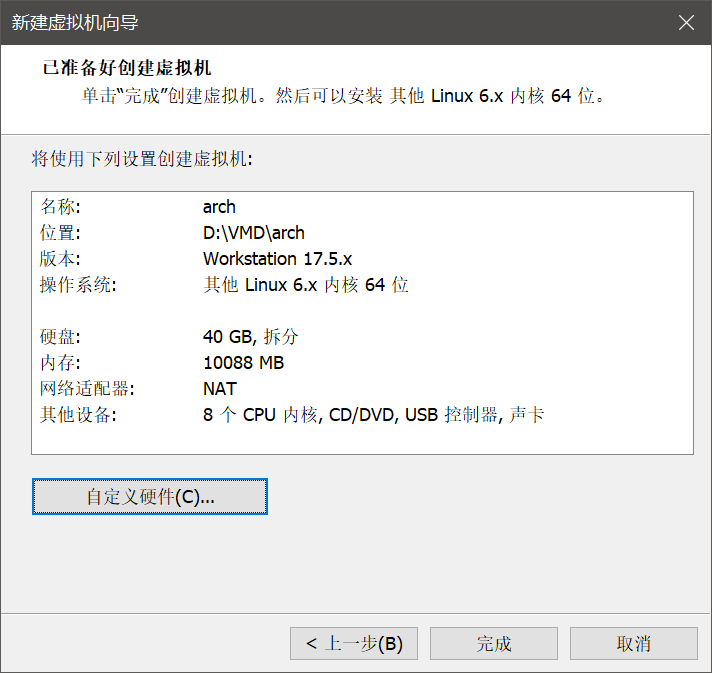
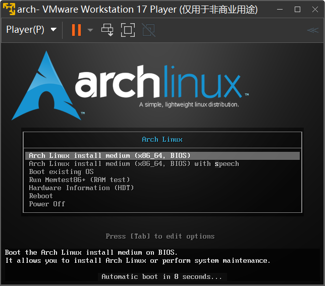
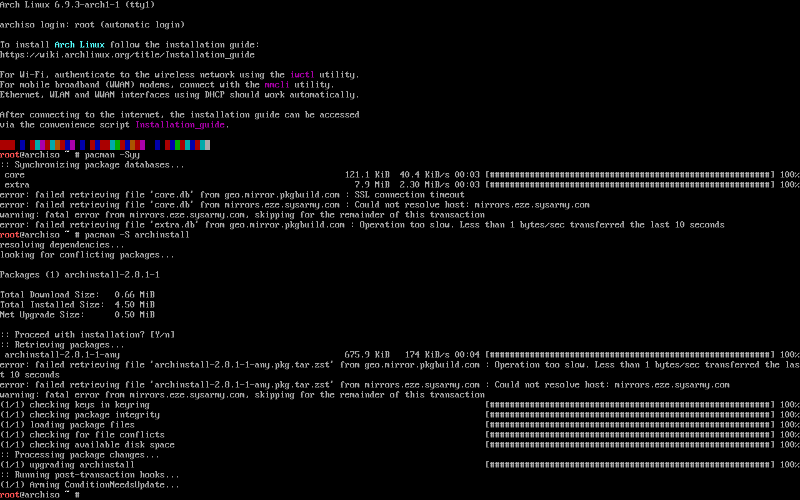
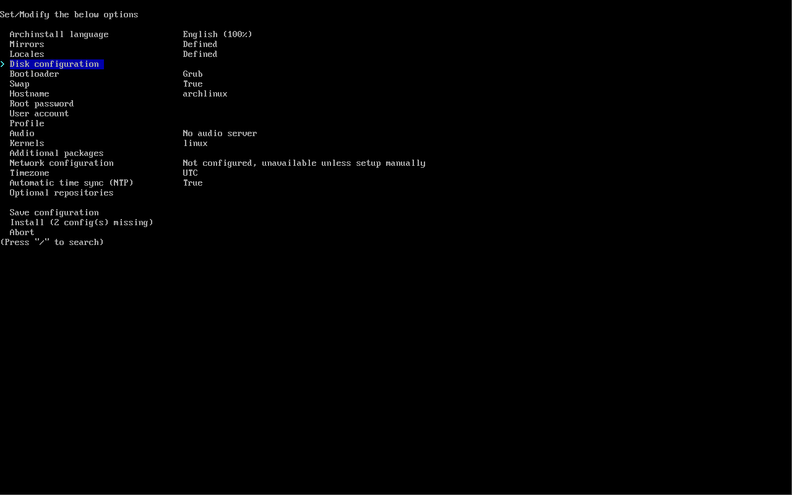
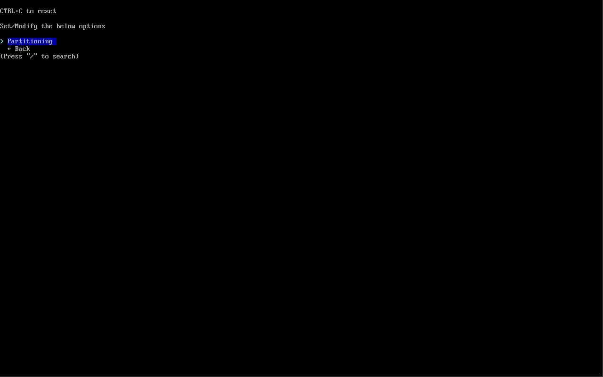
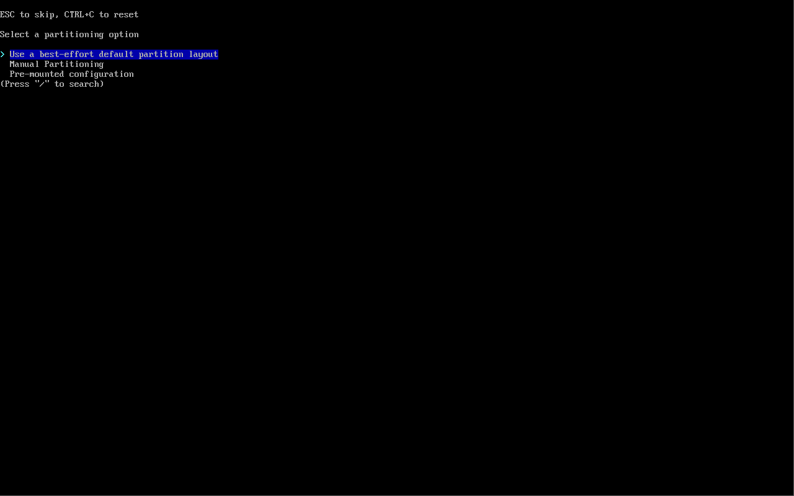
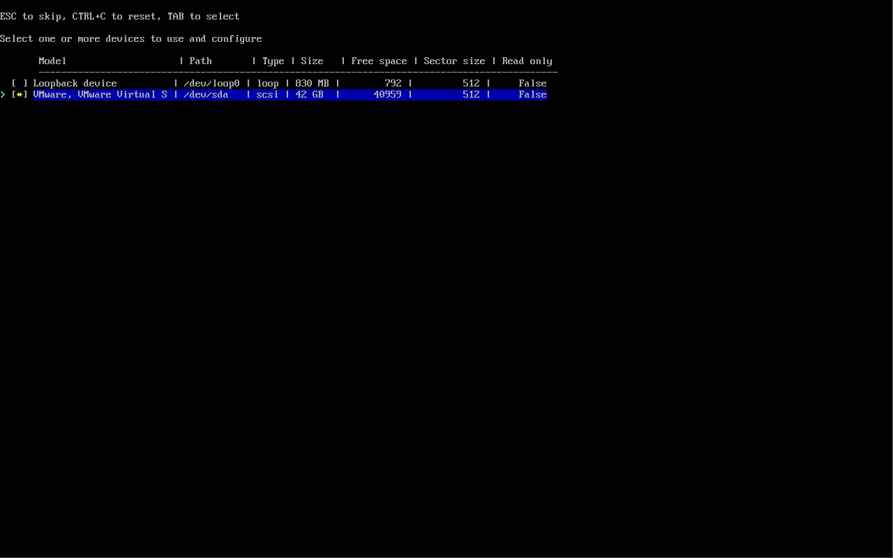
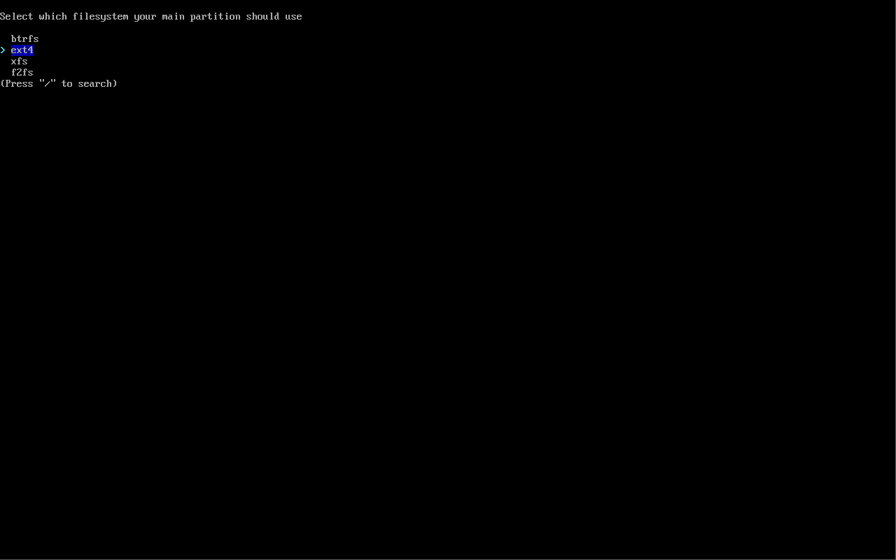
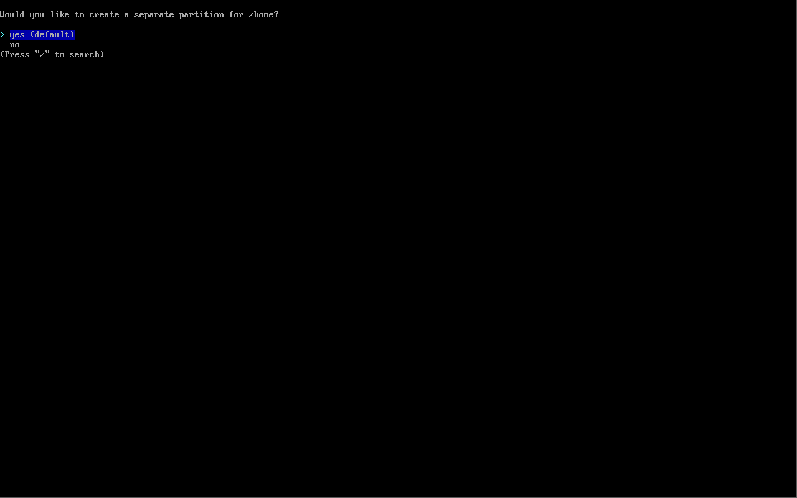
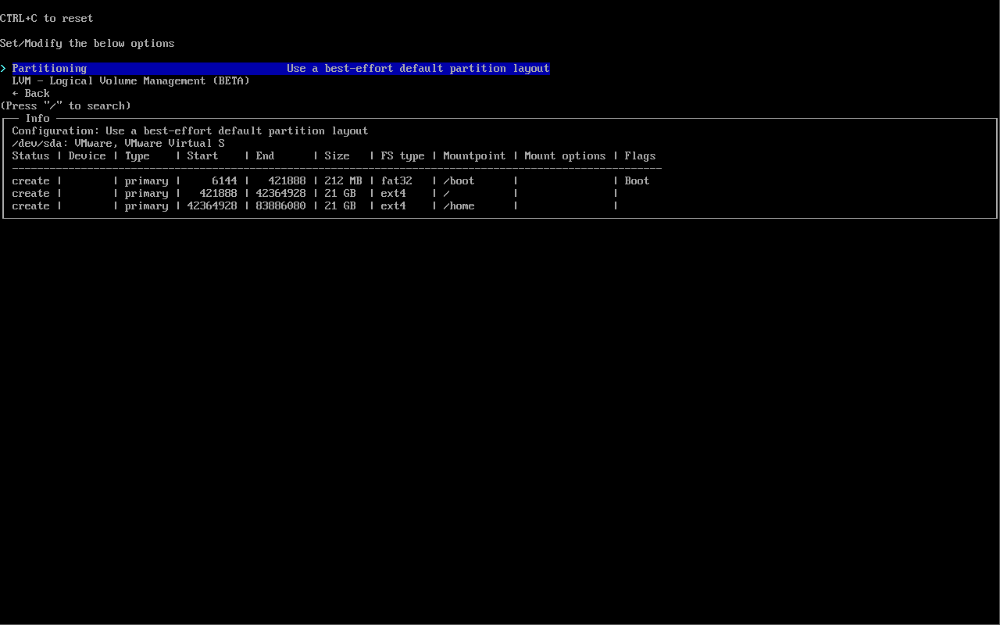

# issue: the auto partitioning size for /boot is too small
When using auto default ext4 partition option, it will only create 212MB fat32 for /boot.

## 0. environment
- windows 10 pro 21H2 LTSC 19044.4529
- vmware player 17.5.0 build-22583795
- archlinux-2024.06.01-x86_64.iso

## 1. vmware player configuration

## 2. arch iso boot menu

## 3. update archinstall

## 4. run archinstall & create partitions

